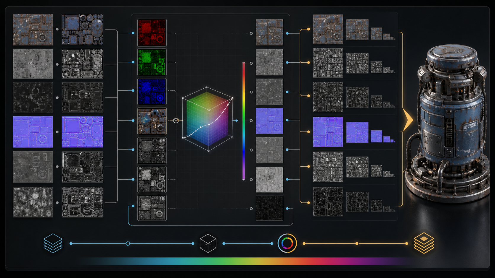

# dcc-texture-pipeline

Deterministic, DCC-neutral texture processing built on OpenImageIO and
OpenColorIO. Use it between generated/downloaded source images and host
material binding.

## Included skills

- `oiio-textures`: inspect images and build tiled, mipmapped renderer textures.
- `ocio-color`: validate OCIO configs and convert pixels between named spaces.

Install OpenImageIO and OpenColorIO command-line tools, then add both `skill/*`
directories to the DCC-MCP skill path.

